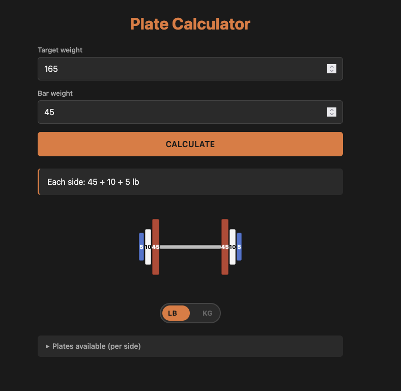

# Plate Calculator

A visual barbell plate calculator with inventory awareness and competition-color plate visualization.

**Live demo:** https://johnnylenny.github.io/plate-calculator/



## What it does

Enter a target weight and the app tells you exactly which plates to load on each side of the bar. Shows a visual representation with plates color-coded to match IPF/IWF competition standards.

## Features

- **Unit toggle:** switch between pounds and kilograms with one tap. Bar weight auto-adjusts to standard (45 lb / 20 kg).
- **Visual bar display:** renders the bar with plates sized and colored proportionally. Biggest plates on the outside.
- **Competition colors:** plates are color-coded (red, blue, yellow, green, white) based on IPF/IWF standards. LB plates use a matched palette so visual identification is consistent across units.
- **Inventory tracking:** tell the app which plates you actually own and it won't recommend plates you don't have. Useful for home gyms.
- **Closest-achievable warnings:** if your target weight can't be loaded exactly (e.g., 227 lb), the app tells you the closest weight you can hit and how much you're short.

## How to use

1. Enter your target weight
2. Adjust bar weight if using a non-standard bar
3. Expand "Plates available (per side)" to set your inventory (defaults assume a standard home gym set)
4. Toggle LB/KG at the bottom if needed
5. Hit Calculate

## Running locally

No build step. Clone the repo and open `index.html` in any browser.

```bash
git clone git@github.com:johnnylenny/plate-calculator.git
cd plate-calculator
open index.html
```

## Built with

Plain HTML, CSS, and JavaScript. No frameworks, no dependencies, no build tools.

## License

MIT